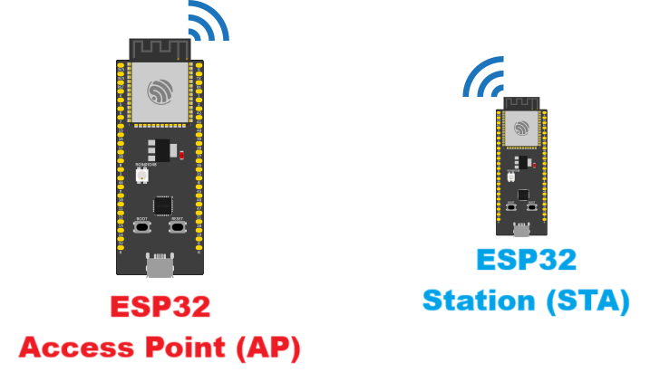

# ESP32_AP_STA
Comunicação entre duas placas ESP32 sem utilização de roteador WiFi

Comunicação direta entre duas placas ESP32, sem a utilização de um roteador WiFi. A comunicação ocorre por meio de uma rede local criada por uma das ESP32 (modo SoftAP), à qual a outra ESP32 se conecta como cliente
(modo Station). Essa abordagem é útil em cenários onde não há acesso a uma infraestrutura de rede existente, como em aplicações móveis, ambientes remotos ou protótipos autônomos.

O sistema consiste em duas placas ESP32:
- ESP32-A (SoftAP): cria uma rede WiFi própria e atua como servidor HTTP para receber comandos. Também possui um botão físico que, ao ser pressionado, envia uma requisição HTTP para a ESP32-B, acionando seu LED.
- ESP32-B (Station): conecta-se à rede criada pela ESP32-A. Também atua como servidor HTTP para receber comandos da ESP32-A, e possui seu próprio botão que, ao ser pressionado, envia uma requisição HTTP para a ESP32-A para acionar seu LED.

Apesar de ter sido utilizado o protocolo HTTP, esse sistema também pode ser utilizado emprengando UDP, WebSocket e ESP-Now.
